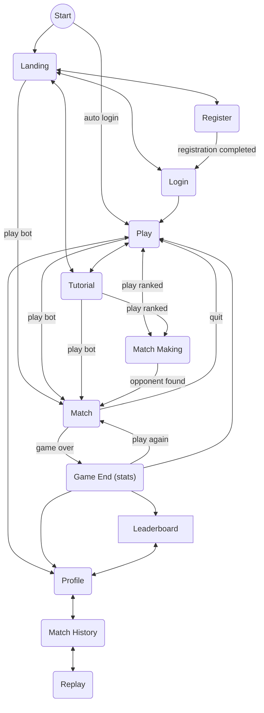
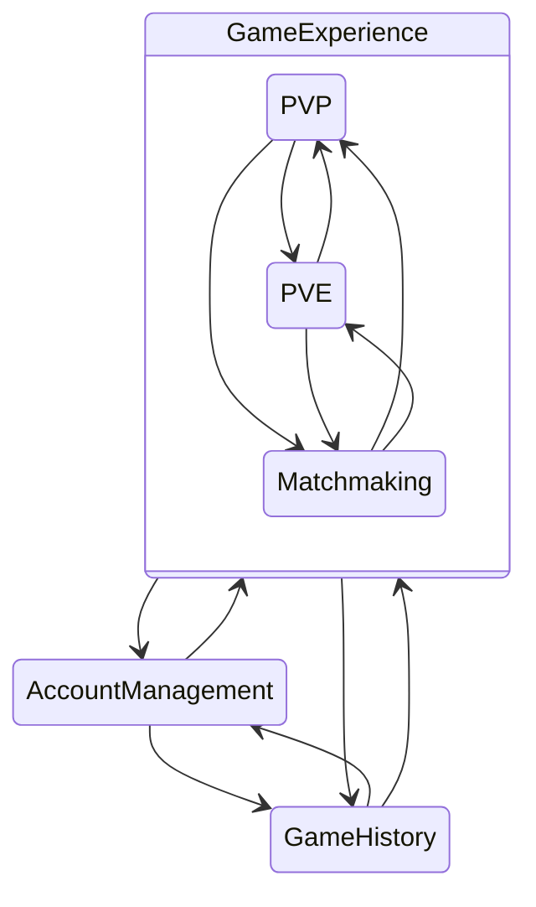

# Sandpiles

Project for the course _Applicazioni e Servizi Web_

Andrea Biagini - 0001145679 <andrea.biagini5@studio.unibo.it>

Filippo Gurioli - 0001146182 <filippo.gurioli@studio.unibo.it>

Leonardo Randacio - 0001125080 <leonardo.randacio@studio.unibo.it>

<!-- TODO PUT DELIVERY DATE HERE -->

## Introduction

_Sandpiles_ is a project designed to emulate the functionality of online board game platforms, providing an interactive and competitive environment for players of all skill levels to play _Sandpiles_. The platform offers real-time matchmaking, AI-driven opponent, statistics review and match history review.

The _Sandpiles_ game is based on the [Abelian sandpiles mathematical model](https://en.wikipedia.org/wiki/Abelian_sandpile_model). It sees two players face each other head to head in a strategic game with time constrains.

Developed with a focus on usability, performance, and scalability, _Sandpiles_ aims to demonstrate best practices in web application development while delivering an engaging and accessible game experience.

## Requirements

During project analysis the following requirements have been identified.

### Functional Requirements

#### User Functional Requirements

The user can:

1. User authentication
   1. Register a new account on the website
   1. Login to the website using an existing account
   1. Logout from the website
1. Profile
   1. View profile statistics
   1. View profile game history
      1. Review old games move by move
   1. Customize profile settings
      1. Load a custom profile picture
      1. Set the website theme
      1. Change profile name
      1. Change profile password
      1. Customize the game board style choosing from some given styling options
1. Game
   1. As a logged in user
      1. Play a ranked game against other users of similar rating
      1. Play an unranked game against an AI opponent
   1. As a guest user
      1. Play an unranked game against an AI opponent
   1. Gameplay
      1. Add a grain to a controller pile
      1. View opponents moves
      1. View personal and opponent clock time remaining
      1. Resign the current game
      1. Disconnect from the current game
1. View the website leaderboard
1. View a tutorial on _Sandpiles_ game rules
1. Developers
   1. Use the public API to access data about players and games, in an authenticated manner
   1. Find the public API documentation on the _Sandpiles_ website

#### System Functional Requirements

- usare jwt?
- gestione dati sensibili (hashing locale, salt in db, conferma e-mail)

1. Security
   1. Password hashing client side
   1. Matching double password input at registration time
   1. Matching double password input at password change time
   1. Hashed password storage with salting server side
   1. Profile confirmation with e-mail
1. User session handling
1. Badge system handling to encourage user retention

### Non-Functional Requirements

1. Responsive UI: The website interface adapts to the user's device to allow identical use across devices
1. AI opponent responds to the user's moves in under a second
1. Intuitive UI design allows users to interact with the website intuitively

### Implementation Requirements

1. MEVN
   1. MongoDB database technology
   1. Express.js backend technology
   1. Vue.js frontend technology
   1. Node.js runtime environment
1. Logical programming language for game AI

## Design

The following design has been developed starting from the user stories specified [here](user-stories.md). From the user stories we also have derived the domain model (which established an ubiquitous jargon) and the pages flow diagram as shown below.

Based on the pages flow a project mockup has been developed also taking into account user experience and adopting a user centered approach.

Requirements suggested an hexagonal client server architecture as explained in the dedicated [sub-section](#architecture).

### Domain Model

**Domain**: Sandpiles game

**Contexts**:

- Account Management
- Game Experience
  - PVP
  - PVE
  - Matchmaking
- Game History

**Glossary**:

_User_: a human interacting with the application through the UI

_Player_: a User interacting with the sandpiles game.

_Login_: access the application with a given account.

_Register_: the creation of a new account.

_Game Board_: square field divided into square Cells

_Cell_: a tile of the Game Board.

_Pile_: a pawn on a Cell owned by a Player, with a number of Grains.

_Grain_: fundamental unit of a Pile.

_Owner of a Pile_: the player who owns the pile.

_Game_: a sequence of Turns on the Game Board ending when the Win Condition is satisfied for one player.

_Win Condition_: the Game Board state where all Piles are owned by one player or the opponent clock's time is finished.

_Turn_: a player move and its eventual collapses.

_Move_: interaction by which a player increases the number of grains in an owned pile by 1.

_Collapse_: the event of a pile reaching 4 grains. This event will:

- remove the current pile
- let the adjacent cells be conquered by the owner of the collapsing pile

_Conquer_: the event of a cell where:

- if empty, a pile with 1 grain is placed
- if not empty, the pile is incremented by 1 and, if the owner is different, the ownership is changed to the conqueror (i.e. the player who made the move)

_Clock_: time counter that tracks how many seconds each player has left to play to game

_Glicko rating system_: method used to calculate and update player ratings in competitive games and sports ([link](https://en.wikipedia.org/wiki/Glicko_rating_system)).

_Glicko Ranking_: ranking rappresenting the strenght of a given player.

_Matchmaking_: the algorithm responsible for selecting players to face each
other among the players available.

#### Context map

The following context map arises from the previous description.

<!-- NON HO ANCORA MAPPATO I PUNTI DI CONNESSIONE TRA I VARI CONTESTI -->

### Mockup

### Architecture

### Detailed Design

<!-- RICORDARSI DI INSERIRE COME SONO STATI MAPPATI I VARI CONCETTI DI UBIQUITOUS LANGUAGE (in quale building block) -->

## Technologies

MEVN

## Code

Solo aspetti rilevanti.
0.6

## Tests

Test effettuati sul codice e test con utenti.
10.7

## Deployment

Rilascio, installazione e messa in funzione.
0.8

## Conclusioni

Conclusioni
