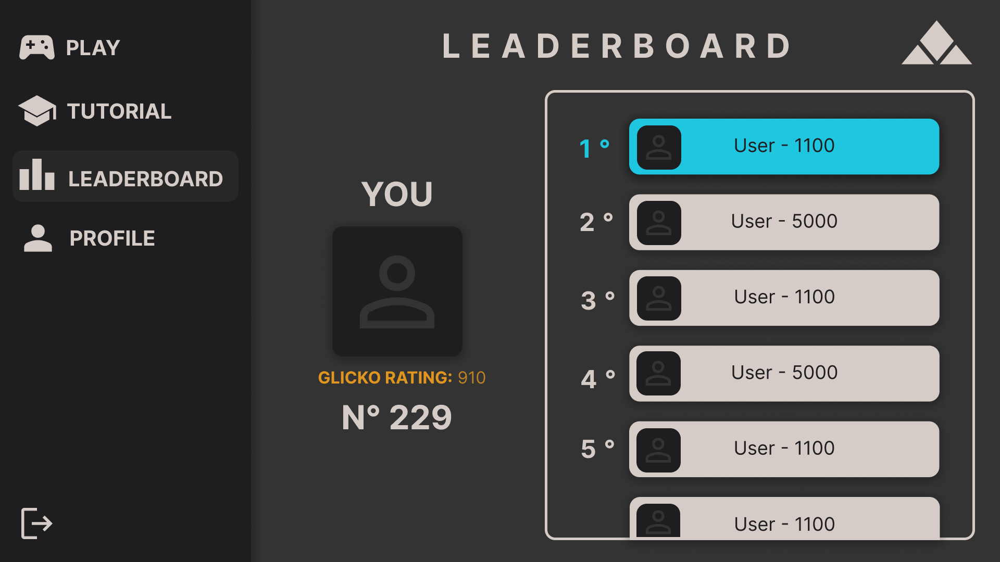
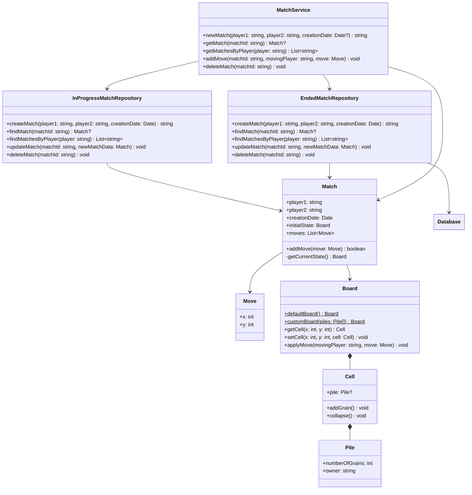

# Sandpiles

Project for the course _Applicazioni e Servizi Web_

Andrea Biagini - 0001145679 <andrea.biagini5@studio.unibo.it>

Filippo Gurioli - 0001146182 <filippo.gurioli@studio.unibo.it>

Leonardo Randacio - 0001125080 <leonardo.randacio@studio.unibo.it>

<!-- TODO PUT DELIVERY DATE HERE -->

- [Sandpiles](#sandpiles)
  - [Introduction](#introduction)
  - [Requirements](#requirements)
    - [Functional Requirements](#functional-requirements)
      - [User Functional Requirements](#user-functional-requirements)
      - [System Functional Requirements](#system-functional-requirements)
    - [Non-Functional Requirements](#non-functional-requirements)
    - [Implementation Requirements](#implementation-requirements)
  - [Design](#design)
    - [Domain Model](#domain-model)
      - [Context map](#context-map)
    - [Mockup](#mockup)
    - [Architecture](#architecture)
      - [Frontend](#frontend)
      - [Backend](#backend)
    - [Detailed Design](#detailed-design)
      - [Game State Data Representation](#game-state-data-representation)
      - [Rating System](#rating-system)
      - [Matchmaking](#matchmaking)
        - [Server side matchmaking class diagram](#server-side-matchmaking-class-diagram)
        - [Matchmaking sequence diagram](#matchmaking-sequence-diagram)
        - [Bot Matchmaking](#bot-matchmaking)
          - [Bot Matchmaking sequence diagram](#bot-matchmaking-sequence-diagram)
        - [API](#api)
      - [Match](#match)
        - [API](#api-1)
      - [Game AI](#game-ai)
  - [Implementation](#implementation)
    - [Game AI](#game-ai-1)
  - [Technologies](#technologies)
  - [Code](#code)
  - [Tests](#tests)
  - [Deployment](#deployment)
  - [Conclusions](#conclusions)
    - [Future Work](#future-work)

## Introduction

_Sandpiles_ is a project designed to emulate the functionality of online board game platforms, providing an interactive and competitive environment for players of all skill levels to play _Sandpiles_. The platform offers real-time matchmaking, AI-driven opponent, statistics review and match history review.

The _Sandpiles_ game is based on the [Abelian sandpiles mathematical model](https://en.wikipedia.org/wiki/Abelian_sandpile_model). It sees two players face each other head to head in a strategic game with time constrains.

Developed with a focus on usability, performance, and scalability, _Sandpiles_ aims to demonstrate best practices in web application development while delivering an engaging and accessible game experience.

## Requirements

During project analysis the following requirements have been identified.

### Functional Requirements

#### User Functional Requirements

The user can:

1. User authentication
   1. Register a new account on the website
      1. Choose a unique username
      1. Choose an email
      1. Confirm the password
      1. Choose a password
      1. Confirm the password
   1. Login to the website using an existing account
   1. Logout from the website
1. Profile
   1. View profile statistics
   1. View profile game history
   1. Customize profile settings
      1. Change profile username
      1. Change profile password
      1. Change profile email
1. Game
   1. As a logged in user
      1. Play a ranked game against other users of similar rating
      1. Play an unranked game against an AI opponent
   1. As a guest user
      1. Play an unranked game against an AI opponent
   1. Gameplay
      1. Add a grain to a controller pile
      1. View opponents moves
      1. Disconnect from the current game
1. View the website leaderboard
1. View a tutorial on _Sandpiles_ game rules

#### System Functional Requirements

- usare jwt?
- gestione dati sensibili (hashing locale, salt in db, conferma e-mail)

1. Security
   1. Password hashing client side <!-- is this implemented? -->
   1. Matching double password input at registration time
   1. Matching double password input at password change time
   1. Hashed password storage with salting server side
1. User session handling

### Non-Functional Requirements

1. Responsive UI: The website interface adapts to the user's device to allow identical use across devices
1. AI opponent responds to the user's moves in under a second
1. Intuitive UI design allows users to interact with the website intuitively

### Implementation Requirements

1. MEVN
   1. MongoDB database technology
   1. Express.js backend technology
   1. Vue.js frontend technology
   1. Node.js runtime environment
1. Logical programming language for game AI

## Design

The following design has been developed starting from the [user stories](user-stories.md). From the user stories we also have derived the domain model (which established an ubiquitous jargon) and the pages flow diagram as shown below.

Based on the pages flow a project mockup has been developed also taking into account user experience and adopting a user centered approach.

Requirements suggested an hexagonal client server architecture as explained in the dedicated [sub-section](#architecture).

### Domain Model

**Domain**: Sandpiles game

**Contexts**:

- Account Management
- Game Experience
  - PVP
  - PVE
  - Matchmaking
- Game History

**Glossary**:

_User_: a human interacting with the application through the UI

_Player_: a User interacting with the sandpiles game.

_Account_: a User representation with username and password used to access application.

_Login_: access the application with a given account.

_Register_: the creation of a new account.

_Game Board_: square field divided into square Cells

_Cell_: a tile of the Game Board.

_Pile_: a pawn on a Cell owned by a Player, with a number of Grains.

_Grain_: fundamental unit of a Pile.

_Owner of a Pile_: the player who owns the pile.

_Match_: a sequence of Turns on the Game Board ending when the Win Condition is satisfied for one player.

_Win Condition_: the Game Board state where all Piles are owned by one player or the opponent clock's time is finished.

_Turn_: a player move and its eventual collapses.

_Move_: interaction by which a player increases the number of grains in an owned pile by 1.

_Collapse_: the event of a pile reaching 4 grains. This event will:

- remove the current pile
- let the adjacent cells be conquered by the owner of the collapsing pile

_Conquer_: the event of a cell where:

- if empty, a pile with 1 grain is placed
- if not empty, the pile is incremented by 1 and, if the owner is different, the ownership is changed to the conqueror (i.e. the player who made the move)

_Clock_: time counter that tracks how many seconds each player has left to play to game

_Elo rating system_: method used to calculate and update player ratings in competitive games and sports ([wikipedia](https://en.wikipedia.org/wiki/Elo_rating_system)).

_Elo Ranking_: ranking rappresenting the strenght of a given player.

_Matchmaking_: the algorithm responsible for selecting players to face each
other among the players available.

#### Context map

The following context map arises from the previous description.

### Mockup

\newpage

The following are the responsive versions of the mockup pages.

\newpage

### Architecture

#### Frontend

The frontend uses a component-based architecture.

The main components map one-to-one the pages listed in the [mockup](#mockup).

Also some components are present in all pages, such as the header and the footer.

Components diagram

The arrows should be read as "depends on" (e.g. A --> B should be read A depends on B).

#### Backend

The backend uses an hexagonal architecture, leveraging Domain Driven Design [DDD](https://it.wikipedia.org/wiki/Domain-driven_design) principles.

This graph represents the dependencies in the hexagonal architecture.

The arrows should be read as "depends on" (e.g. A --> B should be read A depends on B).

### Detailed Design

Repository classes should only implement CRUD (Create, Read, Update, Delete) operations, while higher-level operations should be implemented in the Service classes.

#### Match

Matches can be represented uniquely by:

- A pair of players
- A starting board
- A list of moves
- A creation date

The starting board can be represented as a matrix of dimensions $D \times D$ where every given $x_{i,j}$ is a cell that can contain a pile, in which the number of grains is stored.

The list of moves can be represented as a list of tuples $(i,j)$ where the tuple represents the coordinates of the pile where the player has decided to add a grain.

<!-- RICORDARSI DI INSERIRE COME SONO STATI MAPPATI I VARI CONCETTI DI UBIQUITOUS LANGUAGE (in quale building block) -->

##### Class diagram

##### API

The match system uses Socket.IO for real-time communication:

**Client to Server Events:**

- `emit('getMatch')`:
  - Gets a match with the given match ID.
  - Parameters:
    - `matchId`: the ID of the desired match
- `emit('addMove')`:
  - Adds a move to the given match with the provided parameters, if possible.
  - Parameters:
    - `matchId`: the ID of the match in which add the move
    - `movingPlayer`: the username of the player who is performing the move
    - `x`, `y`: the move coordinates
- `emit('matchHistory', <username>)`:
  - Returns a list of match IDs corresponding to ended matches in which the player with the given username has played.
  - Parameters:
    - `username`: the username of the player

**Server to Client Events:**

- `emit('move')`:
  - The server sends a move to interested clients.
  - Parameters:
    - `movingPlayer`: the username of the player who is performing the move
    - `x`, `y`: the move coordinates
- `emit('over')`:
  - The server tells clients that the game is over.

#### Rating System

The rating system is based on the Elo rating system, which is a method for calculating the relative skill levels of players in two-player games.

Every player has a rating, which is a number that represents their skill level. The higher the rating, the better the player.

The rating is updated after each match based on the outcome of the match and the ratings of the players involved.

The rating is updated using the following formula:

Rnew = Rold + K \* (S - E)

Where:

- E is the expected score, calculated using the following formula: E = 1 / (1 + 10^((Ropponent - Rold) / 400))
- Rnew is the new rating
- Rold is the old rating
- Ropponent is the rating of the opponent
- K is a constant that determines the maximum possible adjustment per game
- S is the actual score (1 for a win, 0.5 for a draw, 0 for a loss)
- 400 is a constant that determines the sensitivity of the rating system

The K constant is set to 32.

#### Matchmaking

The matchmaking system is responsible for pairing players with similar Elo ratings.

The server will check if there are other players in the queue with similar Elo ratings. If so, it will create a match and notify both players.

If no players are found, the server will add the player to the queue and wait for other players to join.

Every 3 seconds, the server will check if there are players in the queue with compatible Elo ratings. If so, it will create a match and notify both players.

Every 10 seconds a player spends in the queue, the matchmaking requirements are slackened as by the following formula:

IsValidMatch(baseValue , rating1 , rating2 , time1 , time2) =

| rating1 - rating2 | <= min( (time1 / 10), (time2 / 10) ) \* 100 + baseValue

Where:

- IsValidMatch is a function that returns true if the match is valid and false otherwise
- rating1 and rating2 are the Elo ratings of the two players
- time1 and time2 are the times spent in the queue by the two players in seconds
- baseValue is a constant that represents the minimum difference in ratings that is acceptable for a match

If a player disconnects from the queue, the server will remove them from the queue.

##### Server side matchmaking class diagram

##### Matchmaking sequence diagram

##### Bot Matchmaking

The matchmaking system will also allow players to play against a bot.

This operation is a lot simpler than the matchmaking between players.

###### Bot Matchmaking sequence diagram

##### API

The matchmaking system uses Socket.IO for real-time communication:

**Client to Server Events:**

- `emit('requestMatch')`: Requests to be matched with another player

  - Behavior:
    - Adds the player to the matchmaking queue if no suitable match is found
    - When a match is found, removes both players from the queue
    - The server will emit a `matchFound` event to both players

- `emit('requestMatchWithBot')`: Requests to play against a bot opponent
  - Behavior:
    - Creates a match with a bot immediately
    - The server will emit a `matchFound` event to the player

**Server to Client Events:**

- `emit('matchFound', { matchId: string })`: Notifies clients that a match has been created
  - Parameters:
    - `matchId`: Unique identifier for the created match
  - Emitted when:
    - Two players have been successfully matched together
    - A match with a bot has been created

#### Game AI

The AI is designed to play the game by selecting the best move based on the current state of the game board.

The best move is determined by evaluating all possible moves and selecting the one that maximizes the number of grains in the AI player's piles.

## Implementation

### Game AI

The game AI is implemented using [Tau Prolog](https://tau-prolog.org/), a Prolog interpreter for JavaScript.

## Technologies

A MEVN technology stack has been used to implement the project:

- **MongoDB**: NoSQL database used to store user accounts, matches and game history.
- **Express.js**: Web framework for Node.js used to implement the backend API.
- **Vue.js**: JavaScript framework used to implement the frontend.
- **Node.js**: JavaScript runtime environment used to run the backend server.

## Code

Solo aspetti rilevanti.

## Tests

<!-- Test effettuati sul codice e test con utenti. -->

jest and stuff

<!-- TODO specificare come runnare i test, coverage, decisioni ecc-->
<!-- TODO cosa non e' compreso nei test-->

## Deployment

<!-- Rilascio, installazione e messa in funzione. -->

To execute the system, it is necessary to create a .env file specifying
parameters for server and database execution. The `.env` file must be in the
root project directory and must contain the following parameters:

## Conclusions

### Future Work

- Chance to change the username -> the username is not unique anymore
- Timer during a match
- Replay a match
- Improve disconnection handling, right now players are not notified when the opponent disconnects
- Add a chat system to the match
- Profile image upload
