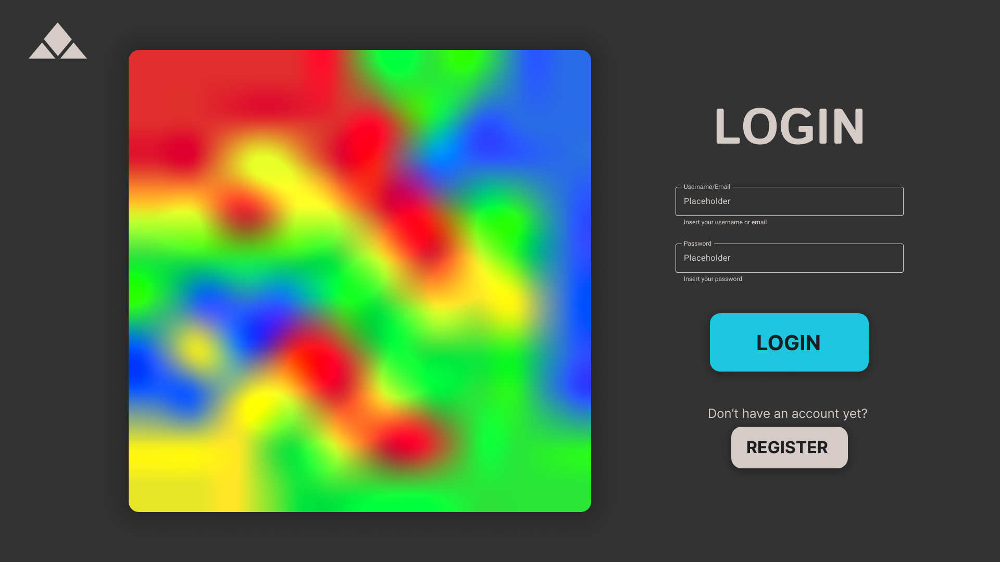

# Sandpiles

Project for the course _Applicazioni e Servizi Web_

Andrea Biagini - 0001145679 <andrea.biagini5@studio.unibo.it>

Filippo Gurioli - 0001146182 <filippo.gurioli@studio.unibo.it>

Leonardo Randacio - 0001125080 <leonardo.randacio@studio.unibo.it>

<!-- TODO PUT DELIVERY DATE HERE -->

- [Sandpiles](#sandpiles)
  - [Introduction](#introduction)
  - [Requirements](#requirements)
    - [Functional Requirements](#functional-requirements)
      - [User Functional Requirements](#user-functional-requirements)
      - [System Functional Requirements](#system-functional-requirements)
    - [Non-Functional Requirements](#non-functional-requirements)
    - [Implementation Requirements](#implementation-requirements)
  - [Design](#design)
    - [Domain Model](#domain-model)
      - [Context map](#context-map)
    - [Mockup](#mockup)
    - [Architecture](#architecture)
      - [Frontend](#frontend)
      - [Backend](#backend)
      - [Model integrity](#model-integrity)
    - [Detailed Design](#detailed-design)
      - [Building blocks](#building-blocks)
      - [Match](#match)
        - [Class diagram](#class-diagram)
        - [API](#api)
      - [Rating System](#rating-system)
      - [Matchmaking](#matchmaking)
        - [Server side matchmaking class diagram](#server-side-matchmaking-class-diagram)
        - [Matchmaking sequence diagram](#matchmaking-sequence-diagram)
        - [Bot Matchmaking](#bot-matchmaking)
          - [Bot Matchmaking sequence diagram](#bot-matchmaking-sequence-diagram)
        - [API](#api-1)
      - [Game AI](#game-ai)
  - [Implementation](#implementation)
    - [Game AI](#game-ai-1)
  - [Technologies](#technologies)
  - [Code](#code)
  - [Tests](#tests)
    - [Nielsen Heuristics](#nielsen-heuristics)
    - [Backend testing](#backend-testing)
    - [Frontend testing](#frontend-testing)
  - [DevOps](#devops)
    - [Git hooks](#git-hooks)
    - [Git branches](#git-branches)
    - [Build automation](#build-automation)
      - [Build](#build)
      - [Serve](#serve)
    - [IDE automation](#ide-automation)
    - [Containerization](#containerization)
    - [CI/CD - GitHub Actions](#cicd---github-actions)
  - [Deployment](#deployment)
  - [Conclusions](#conclusions)
    - [Future Work](#future-work)
      - [Remove constrains on usernames](#remove-constrains-on-usernames)
    - [Add a timer to matches](#add-a-timer-to-matches)
    - [Replay matches](#replay-matches)
    - [Improve disconnection handling](#improve-disconnection-handling)
    - [Implement chat system](#implement-chat-system)
    - [Add profile images](#add-profile-images)
    - [Improve bot capabilities](#improve-bot-capabilities)
    - [Usage of email](#usage-of-email)

## Introduction

_Sandpiles_ is a project designed to emulate the functionality of online board game platforms, providing an interactive and competitive environment for players of all skill levels to play _Sandpiles_. The platform offers real-time matchmaking, AI-driven opponent, statistics review and match history review.

The _Sandpiles_ game is based on the [Abelian sandpiles mathematical model](https://en.wikipedia.org/wiki/Abelian_sandpile_model). It sees two players face each other head to head in a strategic game with time constrains.

Developed with a focus on usability, performance, and scalability, _Sandpiles_ aims to demonstrate best practices in web application development while delivering an engaging and accessible game experience.

## Requirements

During project analysis the following requirements have been identified.

### Functional Requirements

#### User Functional Requirements

The user can:

1. User authentication
   1. Register a new account on the website
      1. Choose a unique username
      1. Choose an email
      1. Confirm the password
      1. Choose a password
      1. Confirm the password
   1. Login to the website using an existing account
   1. Logout from the website
1. Profile
   1. View profile statistics
   1. View profile game history
   1. Customize profile settings
      1. Change profile username
      1. Change profile password
      1. Change profile email
1. Game
   1. As a logged in user
      1. Play a ranked game against other users of similar rating
      1. Play an unranked game against an AI opponent
   1. As a guest user
      1. Play an unranked game against an AI opponent
   1. Gameplay
      1. Add a grain to a controller pile
      1. View opponents moves
      1. Disconnect from the current game
1. View the website leaderboard
1. View a tutorial on _Sandpiles_ game rules

#### System Functional Requirements

1. Security
   1. Matching double password input at registration time
   1. Matching double password input at password change time
   1. Hashed password storage with salting server side
1. User session handling

### Non-Functional Requirements

1. Responsive UI: The website interface adapts to the user's device to allow identical use across devices
1. AI opponent responds to the user's moves in under a second
1. Intuitive UI design allows users to interact with the website intuitively

### Implementation Requirements

1. MEVN
   1. MongoDB database technology
   1. Express.js backend technology
   1. Vue.js frontend technology
   1. Node.js runtime environment
1. Logical programming language for game AI

## Design

The following design has been developed starting from the [user stories](user-stories.md). From the user stories we also have derived the domain model (which established an ubiquitous jargon) and the pages flow diagram as shown below.


Based on the pages flow a project mockup has been developed also taking into account user experience and adopting a user centered approach.

Requirements suggested an hexagonal client server architecture as explained in the dedicated [sub-section](#architecture).

### Domain Model

**Domain**: Sandpiles game

**Contexts**:

- Account Management
- Game Experience
  - PVP
  - PVE
  - Matchmaking
- Game History

**Glossary**:

_User_: a human interacting with the application through the UI

_Player_: a User interacting with the sandpiles game.

_Account_: a User representation with username and password used to access application.

_Login_: access the application with a given account.

_Register_: the creation of a new account.

_Game Board_: square field divided into square Cells

_Cell_: a tile of the Game Board.

_Pile_: a pawn on a Cell owned by a Player, with a number of Grains.

_Grain_: fundamental unit of a Pile.

_Owner of a Pile_: the player who owns the pile.

_Match_: a sequence of Turns on the Game Board ending when the Win Condition is satisfied for one player.

_Win Condition_: the Game Board state where all Piles are owned by one player or the opponent clock's time is finished.

_Turn_: a player move and its eventual collapses.

_Move_: interaction by which a player increases the number of grains in an owned pile by 1.

_Collapse_: the event of a pile reaching 4 grains. This event will:

- remove the current pile
- let the adjacent cells be conquered by the owner of the collapsing pile

_Conquer_: the event of a cell where:

- if empty, a pile with 1 grain is placed
- if not empty, the pile is incremented by 1 and, if the owner is different, the ownership is changed to the conqueror (i.e. the player who made the move)

_Clock_: time counter that tracks how many seconds each player has left to play to game

_Elo rating_: a value representing the skill of the player ([wikipedia](https://en.wikipedia.org/wiki/Elo_rating_system)).

_Elo Ranking_: ranking rappresenting the strenght of a given player.

_Matchmaking_: the phase in which a player searches an opponent among the players available.

#### Context map

The following context map arises from the previous description.


### Mockup





\newpage

The following are the responsive versions of the mockup pages.


\newpage

### Architecture

#### Frontend

The frontend uses a component-based architecture.

The main components map one-to-one the pages listed in the [mockup](#mockup).

Also some components are present in all pages, such as the header and the footer.


Components diagram

The arrows should be read as "depends on" (e.g. A --> B should be read A depends on B).

#### Backend

The backend uses an hexagonal architecture, leveraging Domain Driven Design [DDD](https://it.wikipedia.org/wiki/Domain-driven_design) principles.


This graph represents the dependencies in the hexagonal architecture.

The arrows should be read as "depends on" (e.g. A --> B should be read A depends on B).

#### Model integrity

Every library used is wrapped by an **anti-corruption layer**, an additional layer that abstracts from the library and performs integrity checks.

### Detailed Design

#### Building blocks

This section explains the mapping between domain concepts and building blocks.

- User: entity
- Player: aggregate root (contains account, pile, ranking)
- Account: entity
- Login: domain event
- Register: domain event
- Game Board: aggregate root (contains cells)
- Cell: entity
- Pile: entity
- Grain: value object
- Match: aggregate root (contains players, game board, clocks)
- Win Condition: value object
- Turn: value object
- Move: value object
- Collapse: domain event
- Conquer: domain event
- Clock: entity
- Elo rating: entity
- Elo Ranking: entity
- Matchmaking: domain event

Repsitories, services and factories are implicit for every entity, value object and aggregate root.

Repositories are needed to save, read, update or delete the relative building block; services are meant to expose business logics in order to decide how to manage the underlying building block; factories help repositories and services to create building blocks on demand.

#### Match

Matches can be represented uniquely by:

- A pair of players
- A starting board
- A list of moves
- A creation date

The starting board can be represented as a matrix of dimensions $D \times D$ where every given $x_{i,j}$ is a cell that can contain a pile, in which the number of grains is stored.

The list of moves can be represented as a list of tuples $(i,j)$ where the tuple represents the coordinates of the pile where the player has decided to add a grain.

##### Class diagram


##### API

The match system uses Socket.IO for real-time communication:

**Client to Server Events:**

- `emit('getMatch')`:
  - Gets a match with the given match ID.
  - Parameters:
    - `matchId`: the ID of the desired match
- `emit('addMove')`:
  - Adds a move to the given match with the provided parameters, if possible.
  - Parameters:
    - `matchId`: the ID of the match in which add the move
    - `movingPlayer`: the username of the player who is performing the move
    - `x`, `y`: the move coordinates
- `emit('matchHistory', <username>)`:
  - Returns a list of match IDs corresponding to ended matches in which the player with the given username has played.
  - Parameters:
    - `username`: the username of the player

**Server to Client Events:**

- `emit('move')`:
  - The server sends a move to interested clients.
  - Parameters:
    - `movingPlayer`: the username of the player who is performing the move
    - `x`, `y`: the move coordinates
- `emit('over')`:
  - The server tells clients that the game is over.

#### Rating System

The rating system is based on the Elo rating system, which is a method for calculating the relative skill levels of players in two-player games.

Every player has a rating, which is a number that represents their skill level. The higher the rating, the better the player.

The rating is updated after each match based on the outcome of the match and the ratings of the players involved.

The rating is updated using the following formula:

R<sub>new</sub> = R<sub>old</sub> + K \* (S - E)

Where:

- E is the expected score, calculated using the following formula: E = 1 / (1 + 10^((R<sub>opponent</sub> - R<sub>old</sub>) / 400))
- R<sub>new</sub> is the new rating
- R<sub>old</sub> is the old rating
- R<sub>opponent</sub> is the rating of the opponent
- K is a constant that determines the maximum possible adjustment per game
- S is the actual score (1 for a win, 0.5 for a draw, 0 for a loss)
- 400 is a constant that determines the sensitivity of the rating system

The K constant is set to 32.

#### Matchmaking

The matchmaking system is responsible for pairing players with similar Elo ratings.

The server will check if there are other players in the queue with similar Elo ratings. If so, it will create a match and notify both players.

If no players are found, the server will add the player to the queue and wait for other players to join.

Every 3 seconds, the server will check if there are players in the queue with compatible Elo ratings. If so, it will create a match and notify both players.

Every 10 seconds a player spends in the queue, the matchmaking requirements are slackened as by the following formula:

IsValidMatch(baseValue , rating<sub>1</sub> , rating<sub>2</sub> , time<sub>1</sub> , time<sub>2</sub>) =

| rating<sub>1</sub> - rating<sub>2</sub> | <= min( (time<sub>1</sub> / 10), (time<sub>2</sub> / 10) ) \* 100 + baseValue

Where:

- IsValidMatch is a function that returns true if the match is valid and false otherwise
- rating<sub>1</sub> and rating<sub>2</sub> are the Elo ratings of the two players
- time<sub>1</sub> and time<sub>2</sub> are the times spent in the queue by the two players in seconds
- baseValue is a constant that represents the minimum difference in ratings that is acceptable for a match

If a player disconnects from the queue, the server will remove them from the queue.

##### Server side matchmaking class diagram


##### Matchmaking sequence diagram


##### Bot Matchmaking

The matchmaking system will also allow players to play against a bot.

This operation is a lot simpler than the matchmaking between players.

###### Bot Matchmaking sequence diagram


##### API

The matchmaking system uses Socket.IO for real-time communication:

**Client to Server Events:**

- `emit('requestMatch')`: Requests to be matched with another player

  - Behavior:
    - Adds the player to the matchmaking queue if no suitable match is found
    - When a match is found, removes both players from the queue
    - The server will emit a `matchFound` event to both players

- `emit('requestMatchWithBot')`: Requests to play against a bot opponent
  - Behavior:
    - Creates a match with a bot immediately
    - The server will emit a `matchFound` event to the player

**Server to Client Events:**

- `emit('matchFound', { matchId: string })`: Notifies clients that a match has been created
  - Parameters:
    - `matchId`: Unique identifier for the created match
  - Emitted when:
    - Two players have been successfully matched together
    - A match with a bot has been created

#### Game AI

The AI is designed to play the game by selecting the best move based on the current state of the game board.

The best move is determined by evaluating all possible moves and selecting the one that maximizes the number of grains in the AI player's piles.

## Implementation

Repository classes should only implement CRUD (Create, Read, Update, Delete) operations, while higher-level operations should be implemented in the Service classes.

### Game AI

The game AI is implemented using [Tau Prolog](https://tau-prolog.org/), a Prolog interpreter for JavaScript.

## Technologies

A MEVN technology stack has been used to implement the project:

- **MongoDB**: NoSQL database used to store user accounts, matches and game history.
- **Express.js**: Web framework for Node.js used to implement the backend API.
- **Vue.js**: JavaScript framework used to implement the frontend.
- **Node.js**: JavaScript runtime environment used to run the backend server.

## Code

Solo aspetti rilevanti.

## Tests

### Nielsen Heuristics

Nielsen Heuristics have been used to find any shortcomings in the UX of the project.

The 10th heuristic, help and documentation, has been found to be the least observed, since although a tutorial for the Sandpiles game is present, there is no complete documentation on the website's usage.

<!-- TODO aggiungere immagini screenshottate al tutorial -->

### Backend testing

To test backend code the jest library is used.

To run backend tests  the following command can be used:

`npm run test:server`

### Frontend testing

Frontend testing has not been automated do to time constrains.

Volunteers have been asked to enact the user stories to test the frontend completeness.

## DevOps

### Git hooks

Git hooks have been used to check commit messages: it has been chosen to adhere to [conventional commits standard](https://conventionalcommits.org/en/v1.0.0/). Commits have to have the following structure:

```
<type>(<scope>)<!>: <description>
```

Scopes were usually main concepts like "server", "client", "ui", "auth", ...

This system has been used to comply with [semantic release](https://www.npmjs.com/package/semantic-release): a tool that handles versioning adhering to the [SemVer](https://semver.org/) standard.

### Git branches

In addition to the "main" and the "dev" branches, possible "feature" and "refactor" branches have been created to implement project requirements.

### Build automation

Npm features has been used for build automation. In particular, many custom npm scripts has been develop to ease application development. The main 2 are `build` and `serve`.

#### Build

This task has been created to fully automate the building process. All builds will be inserted in the `dist/` directory providing the input for the publishing task (done in GitHub actions). It first build the server, the client and generate the code documentation (extracted from the code comments). 

Then it copies the `package.json` and `package-lock.json` of root, server and client to the corresponding positions in the `dist` directory. This is needed in order to let people downloading the package to start it with the npm commands.

In the end it adds the `LICENSE`, `CHANGELOG` and `README` to the build.

#### Serve

This task has meant to be used for development purposes. It starts in the local machine client, server and the database so that, in one shot, developers can start debug their application. It features _hot-reloads_ so that changes can be applied on the fly, making the development seamless.

### IDE automation

Since all the developers were working with the same IDE (visual studio code) it also has been created some configuration files to automate the IDE environment. For this purpose in the `.vscode` directory it has been created `extensions.json`, listing all vscode extensions suggested to work with this project and `settings.json`, a list of configurations for the IDE to adhere to the code base standards.

Lastly it has been created the file `asw-project.code-workspace` to exploit split client, server and root configuration files in 3 different workspaces.

### Containerization

The whole system can be executed in Docker containers using Docker Compose; launching configurations and parameters are stored in the `docker-compose.yaml` file. Three services are instantiated:

- First of all, a database container, using the "mongo" image, that saves DB data in a volume on the host machine
- Then, a server container, executing the TypeScript backend via npm
- Lastly, a client container, exposing the Vue.js frontend

Images building are integrated in npm using the "build.docker" task.

The client part uses multi-stage building to expose the service via Nginx and in order to have only compiled code inside the container.

### CI/CD - GitHub Actions

GitHub Actions is used to automate the building, testing, signing, and publishing of the project.

In addition, the project is continuously monitored by the [`Renovate Bot`](https://docs.renovatebot.com/), an automated tool that checks all project dependencies and updates them to the latest available versions. It then creates pull requests with these changes targeting the `main` branch.

To improve efficiency, the GitHub Actions pipeline is configured to ignore pushes made to Renovate branches and to cancel in-progress runs for all branches except `main`.

The pipeline consists of four jobs: `build-test`, `coverage`, `sign-release`, and `send-notification`.

`build-test`

This job builds and tests the project across all major operating systems, using both Node.js versions 20 and 22. It relies on npm tasks defined in the root `package.json`.

`coverage`

If the `build-test` job succeeds, this job sends the test coverage results of the two subprojects to [`SonarCloud`](https://www.sonarsource.com/products/sonarcloud/).

`sign-release`

This job runs in parallel with the `coverage` job. It uses [`semantic-release`](https://github.com/semantic-release/semantic-release) to apply semantic versioning and publish the release artifacts to [`GitHub Releases`](https://github.com/AndreaB2000/ASW-project/releases), [`DockerHub`](https://hub.docker.com/r/andreabiagini5/aswserver), and [`npm`](https://www.npmjs.com/package/@andreabiagini5/applicazioni-e-servizi-web-project).
Before publishing, the artifacts are signed with a GPG key to ensure authenticity.

Additionally, the job automatically generates a changelog based on the commits made in the branch, provided that the commits follow the Conventional Commits standard.

`send-notification`

The final job is a custom step added by the team to send a notification to the project's Discord server, keeping developers informed about the latest pipeline status.

## Deployment

To execute the system, it is necessary to create a .env file specifying
parameters for server and database execution. The `.env` file must be in the root project directory and must contain the following parameters:

```env
DB_PROTOCOL=mongodb
DB_IP=172.0.0.12
DB_PORT=27017

DB_NAME=aswdb
DB_APP_USERNAME=aswuser
DB_APP_PASSWORD=secret-password
DB_ADMIN_USERNAME=tempadmin
DB_ADMIN_PASSWORD=secret-password

MONGODB_COMMAND="mongod --config /etc/mongod.conf"

SERVER_PROTOCOL=http
SERVER_IP=172.0.0.10
SERVER_PORT=3000
SERVER_INTERNAL_PORT=3000

CLIENT_PROTOCOL=http
CLIENT_IP=172.0.0.11
CLIENT_PORT=80

JWT_SECRET=supersecret
JWT_EXPIRATION=3600
```

Then to run it locally, it is sufficient to run the following command:

```bash
npm run start
```

While to run it in production, it is sufficient to run the following command:

```bash
npm run start:docker
```

## Conclusions

The group is sadisfied with the project, although many functionalities have been left behind due to time constrains.

### Future Work

During development the following future improvements have been considered:

#### Remove constrains on usernames

In the current implementation usernames must be unique as they are used as identifiers for user accounts.

An improvement could be to remove this constrain by using hidden identifiers for user accounts, to allow users to modify their username or choose an already taken username.

### Add a timer to matches

To ensure games finish a timer could be implemented to game matches, similar to how it is used in chess.

### Replay matches

Players can currently see their match history, but are unable to actually replay old matches move by move.

This functionality could be added to allow users to review old games and try to learn from them.

### Improve disconnection handling

Users are currently not notified if the opponent has left the match.

A future improvement could notify a player that the opponent has left the match, allowing them to reclaim instant victory.

### Implement chat system

A chat system could be implemented to allow players to chat with eachother while in a match together.

### Add profile images

Users could be interested in adding profile pictures to their profiles to improve the customization of their profile.

### Improve bot capabilities

The current implemenation of the PVE bot has prooven to be easily beated by a capable player and it has also shown to be pretty slow in deciding the best move in complex scenarios.

Both of these problems could be solved improving the prolog implementation of the bot.

### Usage of email

Although users define an email for their account, it is currently not being used in any way.

The email could be used to recover the password or to improve the security of logins.

