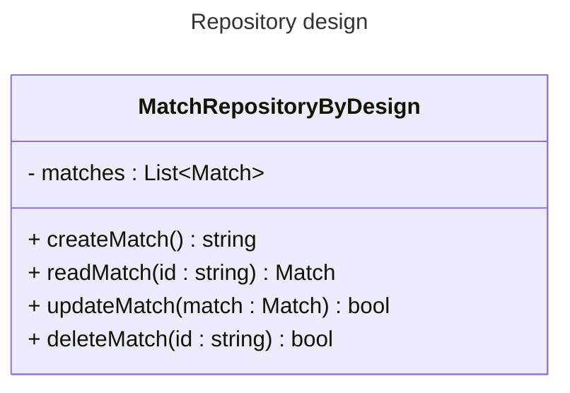
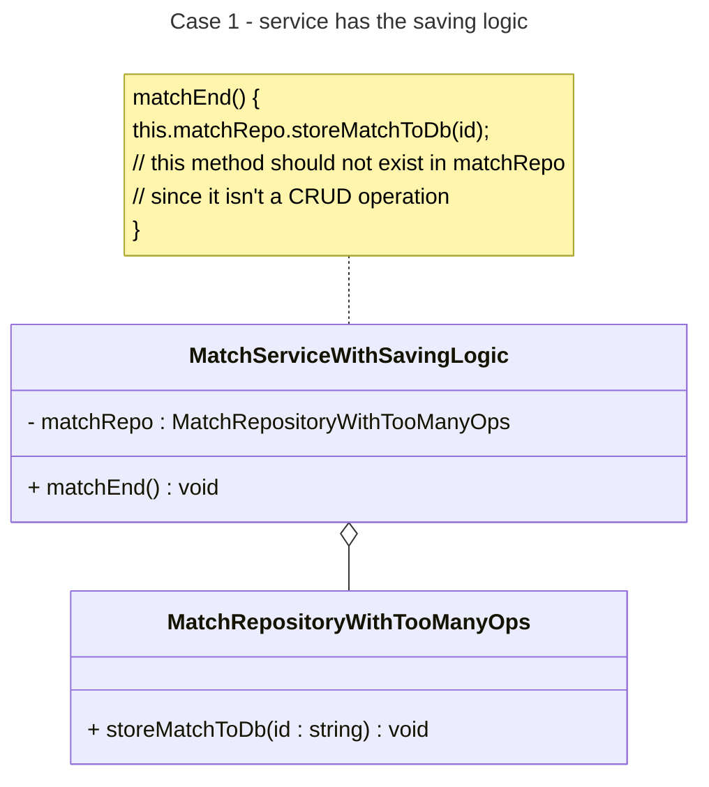
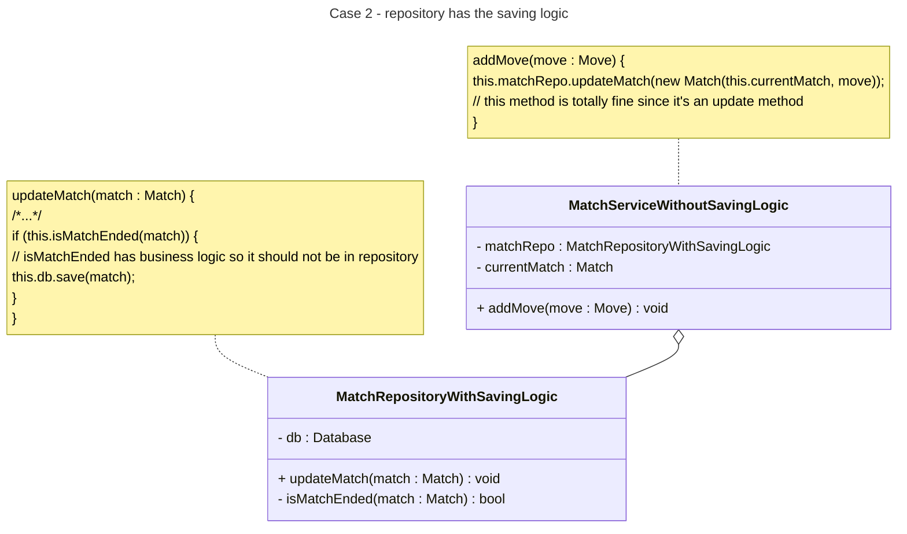
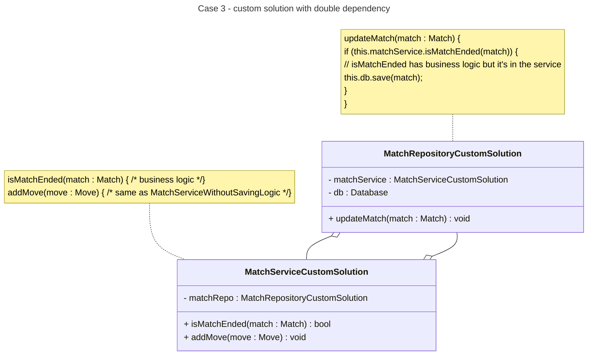

# Question

```mermaid
---
title: Repository design
---

classDiagram
    class MatchRepositoryByDesign {
        - matches : List~Match~
        + createMatch() string
        + readMatch(id : string) Match
        + updateMatch(match : Match) bool
        + deleteMatch(id : string) bool
    }
```

```mermaid
---
title: Case 1 - service has the saving logic
---

classDiagram
    class MatchServiceWithSavingLogic {
        - matchRepo : MatchRepositoryWithTooManyOps
        + matchEnd() void
    }

    note for MatchServiceWithSavingLogic "matchEnd() {
        this.matchRepo.storeMatchToDb(id);
        // this method should not exist in matchRepo
        // since it isn't a CRUD operation
    }"

    class MatchRepositoryWithTooManyOps {
        + storeMatchToDb(id : string) void
    }

    MatchServiceWithSavingLogic o-- MatchRepositoryWithTooManyOps
```

```mermaid
---
title: Case 2 - repository has the saving logic
---

classDiagram
    class MatchServiceWithoutSavingLogic {
        - matchRepo : MatchRepositoryWithSavingLogic
        - currentMatch : Match
        + addMove(move : Move) void
    }

    note for MatchServiceWithoutSavingLogic "addMove(move : Move) {
        this.matchRepo.updateMatch(new Match(this.currentMatch, move));
        // this method is totally fine since it's an update method
    }"

    class MatchRepositoryWithSavingLogic {
        - db : Database
        + updateMatch(match : Match) void
        - isMatchEnded(match : Match) bool
    }

    note for MatchRepositoryWithSavingLogic "updateMatch(match : Match) {
        /\*...\*/
        if (this.isMatchEnded(match)) {
            // isMatchEnded has business logic so it should not be in repository
            this.db.save(match);
        }
    }"

    MatchServiceWithoutSavingLogic o-- MatchRepositoryWithSavingLogic
```

```mermaid
---
title: Case 3 - custom solution with double dependency
---

classDiagram
    class MatchRepositoryCustomSolution {
        - matchService : MatchServiceCustomSolution
        - db : Database
        + updateMatch(match : Match) void
    }

    note for MatchRepositoryCustomSolution "updateMatch(match : Match) {
        if (this.matchService.isMatchEnded(match)) {
            // isMatchEnded has business logic but it's in the service
            this.db.save(match);
        }
    }"

    class MatchServiceCustomSolution {
        - matchRepo : MatchRepositoryCustomSolution
        + isMatchEnded(match : Match) bool
        + addMove(move : Move) void
    }

    note for MatchServiceCustomSolution "isMatchEnded(match : Match) { /\* business logic \*/}
    addMove(move : Move) { /\* same as MatchServiceWithoutSavingLogic \*/}"

    MatchServiceCustomSolution o-- MatchRepositoryCustomSolution
    MatchRepositoryCustomSolution o-- MatchServiceCustomSolution
```
