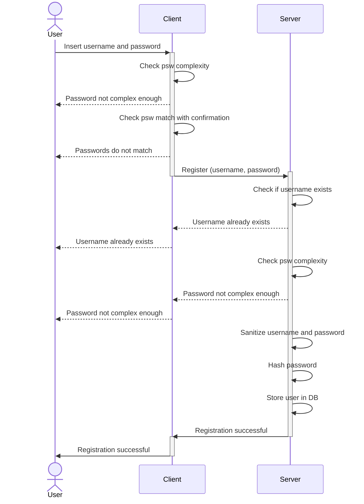
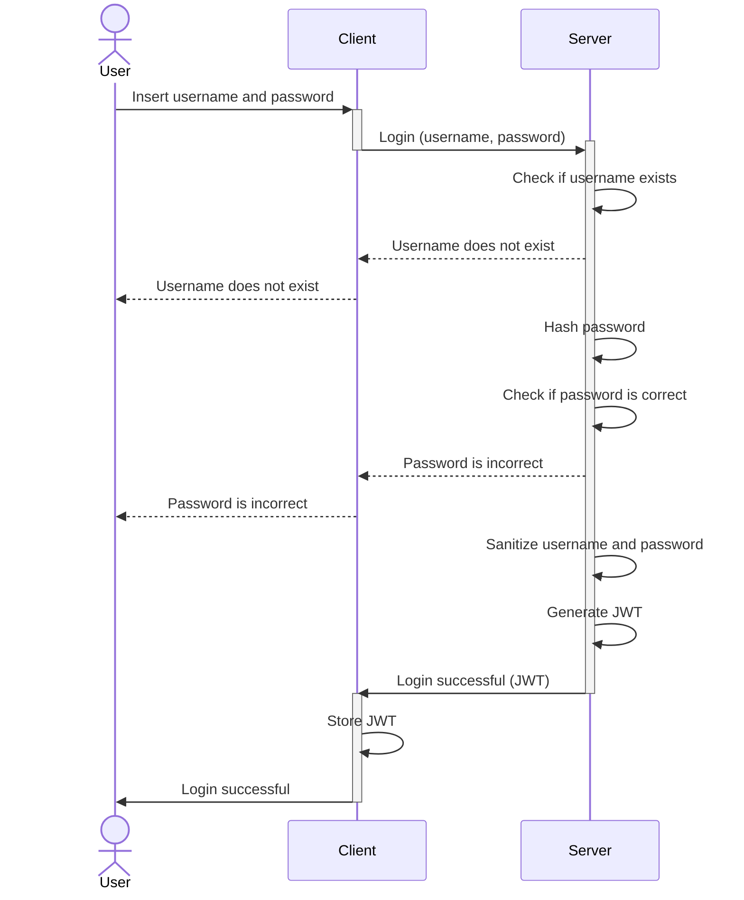

# Detailed Design for Account

## Registration

```mermaid
sequenceDiagram
    actor User
    participant Client
    participant Server
    User ->>+ Client: Insert username and password
    Client ->> Client: Check psw complexity
    Client -->> User: Password not complex enough
    Client ->> Client: Check psw match with confirmation
    Client -->> User: Passwords do not match
    Client ->>+ Server: Register (username, password)
    deactivate Client
    Server ->> Server: Check if username exists
    Server -->> Client: Username already exists
    Client -->> User: Username already exists
    Server ->> Server: Check psw complexity
    Server -->> Client: Password not complex enough
    Client -->> User: Password not complex enough
    Server ->> Server: Sanitize username and password
    Server ->> Server: Hash password
    Server ->> Server: Store user in DB
    Server ->>- Client: Registration successful
    activate Client
    Client ->>- User: Registration successful
```

## Login

```mermaid
sequenceDiagram
    actor User
    participant Client
    participant Server
    User ->>+ Client: Insert username and password
    Client ->>+ Server: Login (username, password)
    deactivate Client
    Server ->> Server: Check if username exists
    Server -->> Client: Username does not exist
    Client -->> User: Username does not exist
    Server ->> Server: Hash password
    Server ->> Server: Check if password is correct
    Server -->> Client: Password is incorrect
    Client -->> User: Password is incorrect
    Server ->> Server: Sanitize username and password
    Server ->> Server: Generate JWT
    Server ->>- Client: Login successful (JWT)
    activate Client
    Client ->> Client: Store JWT
    Client ->>- User: Login successful
```
