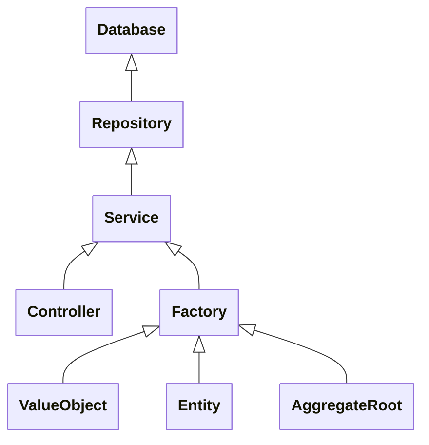

# Architecture

```mermaid
---
config:
    class:
        hideEmptyMembersBox: true
---

classDiagram
    class Database
    class Repository
    class Service
    class Controller
    class Factory
    class ValueObject
    class Entity
    class AggregateRoot

    Database <|-- Repository
    Repository <|-- Service
    Service <|-- Controller
    Service <|-- Factory
    Factory <|-- ValueObject
    Factory <|-- Entity
    Factory <|-- AggregateRoot
```
