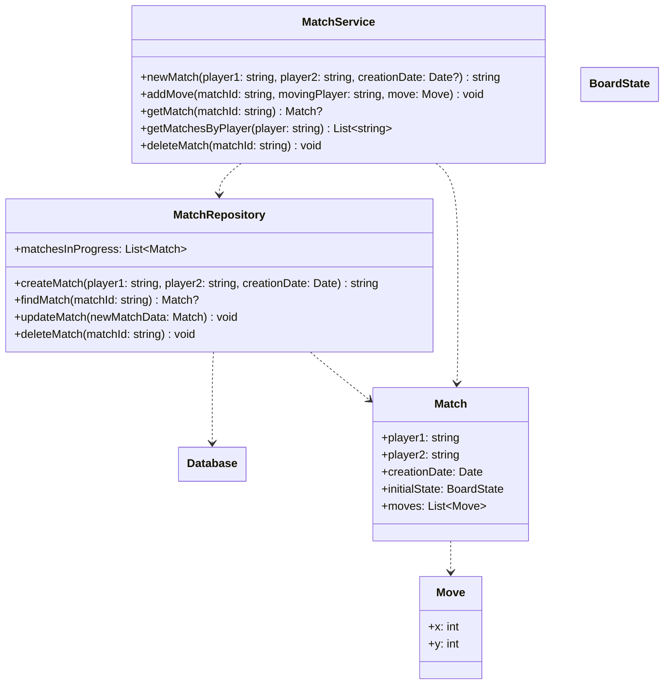

# Match

```mermaid
---
config:
    class:
        hideEmptyMembersBox: true
---

classDiagram
    class Move {
        +x: int
        +y: int
    }

    class Match {
        +player1: string
        +player2: string
        +creationDate: Date
        +initialState: BoardState
        +moves: List~Move~
    }

    class Database

    %% MatchRepository contains the list of all matches that started but are not finished (or abandoned). The system keeps these matches "volatile", to avoid massive accesses to the database, and accepting the fact that these matches wuold be lost if the server fails.
    class MatchRepository {
        %% A list containing all matches that started but are not finished (or abandoned).
        +matchesInProgress: List~Match~

        %% Creates a match inside matchesInProgress.
        +createMatch(player1: string, player2: string, creationDate: Date) string

        %% Returns a match with the given ID, searching in both the DB and the list of matches in progress.
        +findMatch(matchId: string) Match?

        %% Updates the state of a match saved inside the list of matches in progress (an ended match, saved in the DB, can't be updated).
        +updateMatch(newMatchData: Match) void

        %% Deletes a match with the given ID, whether it is in the DB or in the list of matches in progress.
        +deleteMatch(matchId: string) void
    }

    %% MatchesService expose higher-level functionalities, and it is transparent to the matches saving logic.
    class MatchService {

        %% Creates a new match, returns its ID
        +newMatch(player1: string, player2: string, creationDate: Date?) string

        %% Adds a move only if the provided player can make it
        +addMove(matchId: string, movingPlayer: string, move: Move) void

        %% Gets a match with the given ID, if it exists
        +getMatch(matchId: string) Match?

        %% Returns a list of match IDs
        +getMatchesByPlayer(player: string) List~string~

        %% Deletes a match
        +deleteMatch(matchId: string) void
    }

    class BoardState {
    }

    MatchRepository ..> Database
    MatchService ..> MatchRepository
    MatchRepository ..> Match
    MatchService ..> Match
    Match ..> Move
```
