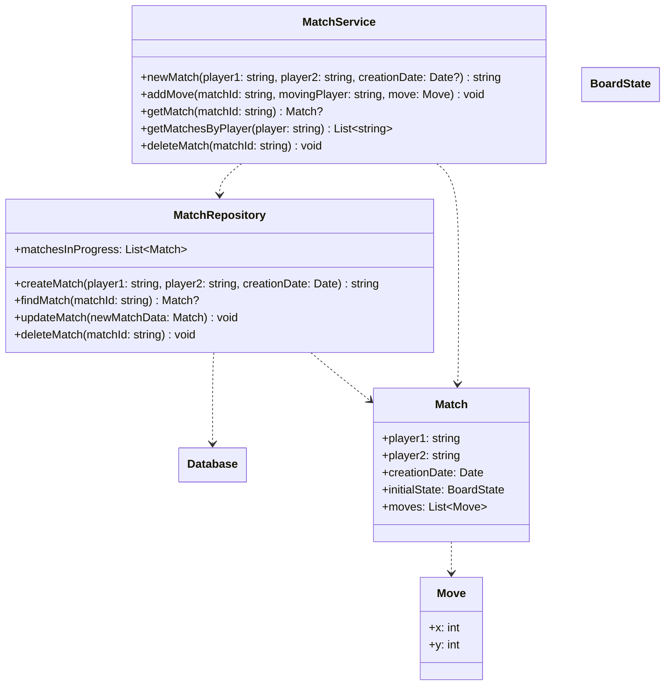

# Match

## APIs

- `POST /match/new`: creates a match, returns its ID

  - Body: `{"player1": string, "player2": string}`
  - Returns: match ID

- `PUT /match/<id>/move`: Adds a move only if the provided player can make it

  - Body: `{"player1": string, "x": int, "y": int}`
  - Returns: feedback

- `GET /match/<id>`: gets a match with the given ID, if it exists

  - Body: `{}`
  - Returns: match or 404 error

- `GET /match/query/<player>`: returns a list of match IDs

  - Body: `{}`
  - Returns: list of matches (or empty list)

- `DELETE /match/delete?id=<matchId>`: deletes a match

  - Body: `{}`
  - Returns: feedback

## Return format proposal

`{"code": <int>, "details": <string|int|list>}`

Code will be composed by two parts: a 2-digit number identifying the request (e.g. for `/match/new` the code will be "10", for `/match/<id>/move` it will be "11") and a 3-digit number to specify the output of the request, drawing inspiration from HTTP return codes (e.g. "200" for "success", "404" for "not found", ...). The "code" field in the returning JSON will be the concatenation of the two numbers; for example, the code "11200" indicates a success in calling the `/match/<id>/move` API.

Details contain the return content of the API (the match in JSON format in case of a call to `/match/<id>`), or some additional information regarding an error.
