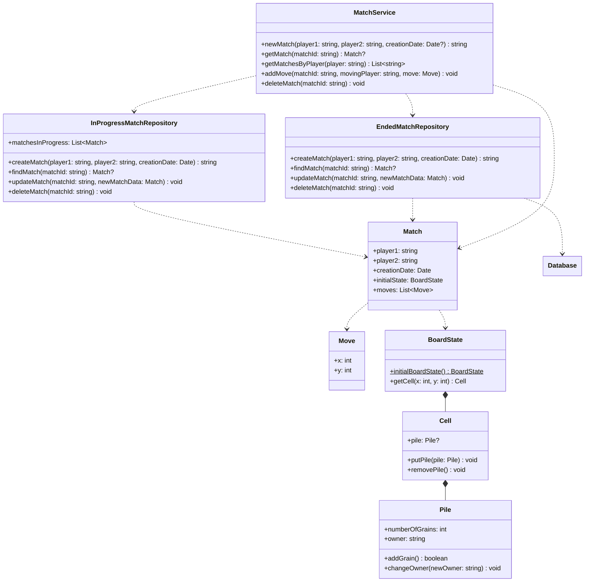

# Match

```mermaid
---
config:
    class:
        hideEmptyMembersBox: true
---

classDiagram
    class Move {
        +x: int
        +y: int
    }

    class Match {
        +player1: string
        +player2: string
        +creationDate: Date
        +initialState: BoardState
        +moves: List~Move~
    }

    class Database

    %% InProgressMatchRepository contains the list of all matches that started but are not finished (or abandoned). The system keeps these matches "volatile", to avoid massive accesses to the database, and accepting the fact that these matches wuold be lost if the server fails.
    class InProgressMatchRepository {
        %% A list containing all matches in progress
        +matchesInProgress: List~Match~

        %% Creates a new match
        +createMatch(player1: string, player2: string, creationDate: Date) string

        %% Returns a match with the given ID
        +findMatch(matchId: string) Match?

        %% Updates the state of a match
        +updateMatch(matchId: string, newMatchData: Match) void

        %% Deletes a match with the given ID
        +deleteMatch(matchId: string) void
    }


    %% EndedMatchRepository handles ended matches, to be saved on the database.
    class EndedMatchRepository {
        %% Creates a new match
        +createMatch(player1: string, player2: string, creationDate: Date) string

        %% Returns a match with the given ID
        +findMatch(matchId: string) Match?

        %% Updates the state of a match
        +updateMatch(matchId: string, newMatchData: Match) void

        %% Deletes a match with the given ID
        +deleteMatch(matchId: string) void
    }

    %% MatchesService expose higher-level functionalities, and it handles the matches saving logic.
    class MatchService {

        %% Creates a new match, returns its ID
        +newMatch(player1: string, player2: string, creationDate: Date?) string

        %% Gets a match with the given ID, if it exists
        +getMatch(matchId: string) Match?

        %% Returns a list of match IDs
        +getMatchesByPlayer(player: string) List~string~

        %% Adds a move only if the provided player can make it
        +addMove(matchId: string, movingPlayer: string, move: Move) void

        %% Deletes a match
        +deleteMatch(matchId: string) void
    }

    %% A fixed-sized matrix of cells
    class BoardState {

        %% The default board state
        +initialBoardState() BoardState$

        +getCell(x: int, y: int) Cell
    }

    %% Board cell which can contain a pile
    class Cell {
        +pile: Pile?
        +putPile(pile: Pile) void
        +removePile() void
    }

    class Pile {
        +numberOfGrains: int
        +owner: string

        %% Returns true if the grain has been added, false if it cannot be added
        +addGrain() boolean
        +changeOwner(newOwner: string) void
    }

    EndedMatchRepository ..> Database
    MatchService ..> InProgressMatchRepository
    MatchService ..> EndedMatchRepository
    InProgressMatchRepository ..> Match
    EndedMatchRepository ..> Match
    MatchService ..> Match
    Match ..> Move
    Match ..> BoardState
    BoardState *-- Cell
    Cell *-- Pile
```
