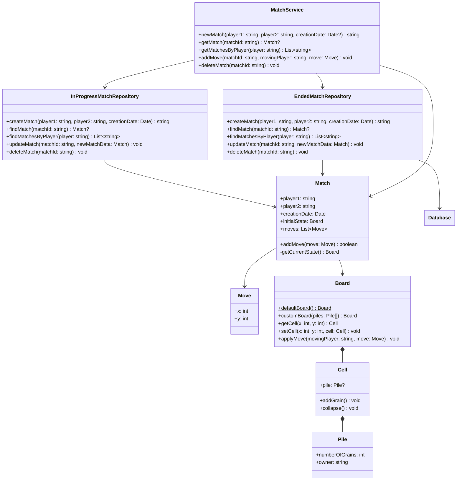

# Match

```mermaid
---
config:
    class:
        hideEmptyMembersBox: true
---

classDiagram
    class Move {
        +x: int
        +y: int
    }

    class Match {
        +player1: string
        +player2: string
        +creationDate: Date
        +initialState: Board
        +moves: List~Move~

        +addMove(move: Move) boolean
        -getCurrentState() Board
    }

    class Database

    %% InProgressMatchRepository handles matches in progress, not yet finished or abandoned.
    class InProgressMatchRepository {
        +createMatch(player1: string, player2: string, creationDate: Date) string
        +findMatch(matchId: string) Match?
        +findMatchesByPlayer(player: string) List~string~
        +updateMatch(matchId: string, newMatchData: Match) void
        +deleteMatch(matchId: string) void
    }

    %% EndedMatchRepository handles ended matches, to be saved on the database.
    class EndedMatchRepository {
        +createMatch(player1: string, player2: string, creationDate: Date) string
        +findMatch(matchId: string) Match?
        +findMatchesByPlayer(player: string) List~string~
        +updateMatch(matchId: string, newMatchData: Match) void
        +deleteMatch(matchId: string) void
    }

    %% MatchesService expose higher-level functionalities, and it handles the matches saving logic.
    class MatchService {
        +newMatch(player1: string, player2: string, creationDate: Date?) string
        +getMatch(matchId: string) Match?
        +getMatchesByPlayer(player: string) List~string~
        +addMove(matchId: string, movingPlayer: string, move: Move) void
        +deleteMatch(matchId: string) void
    }

    %% A fixed-sized matrix of cells
    class Board {
        +defaultBoard() Board$
        +customBoard(piles: Pile[]) Board$

        +getCell(x: int, y: int) Cell
        +setCell(x: int, y: int, cell: Cell) void
        +applyMove(movingPlayer: string, move: Move) void
    }

    %% Board cell which can contain a pile
    class Cell {
        +pile: Pile?
        +addGrain() void
        +collapse() void
    }

    class Pile {
        +numberOfGrains: int
        +owner: string
    }

    EndedMatchRepository --> Database
    MatchService --> InProgressMatchRepository
    MatchService --> EndedMatchRepository
    InProgressMatchRepository --> Match
    EndedMatchRepository --> Match
    MatchService --> Match
    Match --> Move
    Match --> Board
    Board *-- Cell
    Cell *-- Pile
```
