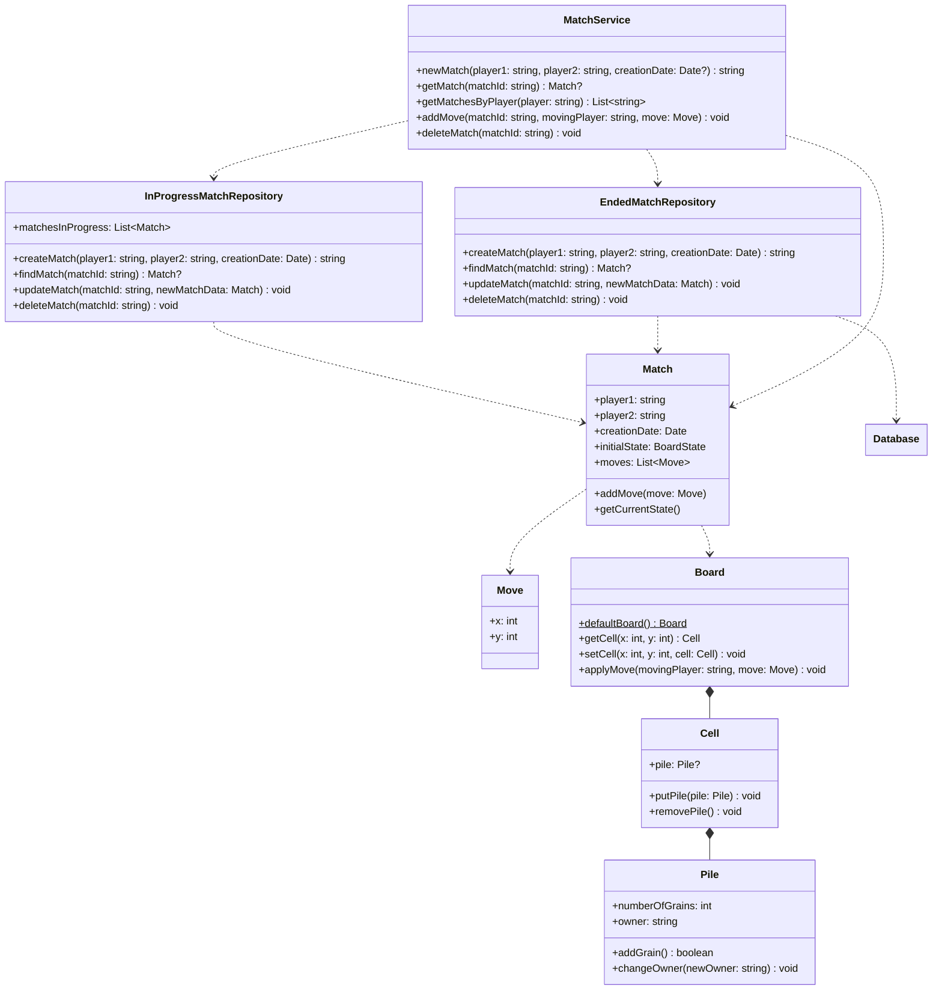

# Match

## APIs

- `POST /match/new`: creates a match, returns its ID

  - Body: `{"player1": string, "player2": string}`
  - Returns:
    - 201 Created - `{"matchId": <string>}`
    - 400 Bad request - `{}` when the body is not complete
    - 401 Unauthorized - `{}` when the client is not logged in
    - 500 Internal server error - `{}` when a generic error occurs

- `PUT /match/<id>/move`: Adds a move only if the provided player can make it

  - Body: `{"player1": string, "x": int, "y": int}`
  - Returns:
    - 200 OK - `{}` when the move is successfully added to the match
    - 400 Bad request - `{}` when the body is not complete
    - 401 Unauthorized - `{}` when the client is not logged in
    - 403 Forbidden - `{}` when the player can't make a move
    - 500 Internal server error - `{}` when a generic error occurs

- `GET /match/<id>`: gets a match with the given ID, if it exists

  - Body: `{}`
  - Returns:
    - 200 OK - `{<match>}` when the move is successfully added to the match
    - 401 Unauthorized - `{}` when the client is not logged in
    - 404 Not found - `{}` when there is no match with the given ID
    - 500 Internal server error - `{}` when a generic error occurs

- `GET /match/query/<player>`: returns a list of match IDs

  - Body: `{}`
  - Returns:
    - 200 OK - `{"matches": [<matches>]}` the list can be empty
    - 401 Unauthorized - `{}` when the client is not logged in
    - 404 Not found - `{}` when the provided player does not exist
    - 500 Internal server error - `{}` when a generic error occurs

- `DELETE /match/delete?id=<matchId>`: deletes a match

  - Body: `{}`
  - Returns:
    - 200 OK - `{}` when the match is successfully deleted
    - 400 Bad request - `{}` when query args are not specified
    - 401 Unauthorized - `{}` when the client is not logged in
    - 403 Forbidden - `{}` when the player can't delete that match
    - 404 Not found - `{}` when the provided match ID does not exist
    - 500 Internal server error - `{}` when a generic error occurs
