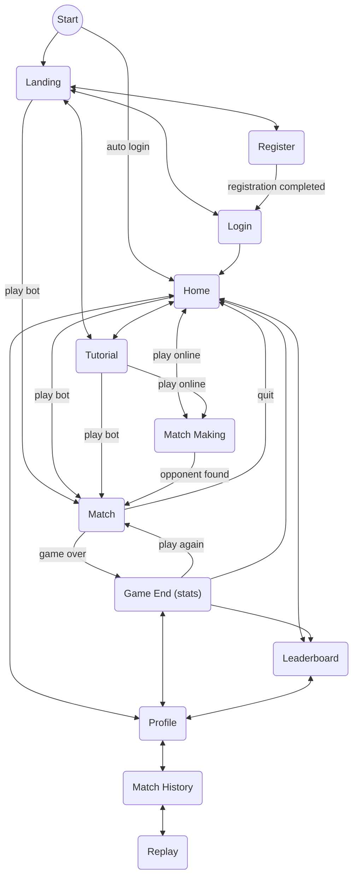

# Pages flow

```mermaid
flowchart TD
    A@{ shape: circle, label: "Start" } -->|auto login| Home(Home)
    A@{ shape: circle, label: "Start" } --> Landing(Landing)
    Landing <--> Login(Login)
    Landing <--> Register(Register)
    Landing <--> Tutorial(Tutorial)
    Landing -->|play bot| Match
    Register -->|registration completed| Login
    Login --> Home
    Home <--> Tutorial(Tutorial)
    Home <-->|play online| MatchMaking(Match Making)
    Home <--> Leaderboard(Leaderboard)
    Home -->|play bot| Match
    Home <--> Profile(Profile)
    Tutorial -->|play online| MatchMaking
    Tutorial -->|play bot| Match
    MatchMaking -->|opponent found| Match(Match)
    Match -->|quit| Home
    Match -->|game over| GameEnd("Game End (stats)")
    GameEnd -->|play again| Match
    GameEnd --> Home
    GameEnd --> Leaderboard
    GameEnd <--> Profile
    Leaderboard <--> Profile
    Profile <--> MatchHistory(Match History)
    MatchHistory <--> Replay(Replay)
```
